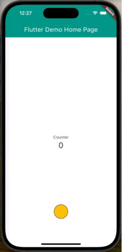

# dot_controller


**dot_controller** is a Controller, Navigator, and Selector.

> Use "dot_controller" to execute your action.

# Usage

```dart

  @override
  Widget build(BuildContext context) {
    return Scaffold(
      appBar: AppBar(
        backgroundColor: Colors.teal,
        title: Text(widget.title, style: const TextStyle(color: Colors.white)),
      ),
      body: Stack(
        children: [
          Center(
            child: Column(
              mainAxisAlignment: MainAxisAlignment.center,
              children: <Widget>[
                const Text(
                  'Counter',
                ),
                Text(
                  '$_counter',
                  style: Theme.of(context).textTheme.headlineMedium,
                ),
              ],
            ),
          ),
          DotController(
            draggingBackgroundColor: Colors.amber,
            stickBackgroundColor: Colors.amber,
            actions: [
              ActionProp(
                icon: const Icon(Icons.add),
                backgroundColor: Colors.white,
                borderColor: Colors.black,
                onAccept: _incrementCounter,
              ),
              ActionProp(
                icon: const Icon(Icons.remove),
                backgroundColor: Colors.red,
                borderColor: Colors.black,
                onAccept: _decrementCounter,
              ),
              ActionProp(
                icon: const Icon(Icons.backspace),
                backgroundColor: Colors.yellow,
                borderColor: Colors.black,
                onAccept: _initCounter,
              ),
            ],
          )
        ],
      ),
    );
  }
```

# Example



# License

[Apache-2.0 license](./LICENSE)
